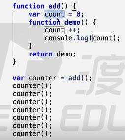

# 主流浏览器及内核
     IE           trident
     Chrome       webkit/blink
     firefox      Gecko
     Opera        presto
     Safari       webkit 
# js变量
     var name; //声明变量
     name=100; //变量赋值
     var name =100；//简化写法
  单一var模式：var a=10,
                  b=20,
                  c=30;
 变量命名规则：
   必须以英文字母、_、$开头;
   可以包含英文字母、_、$、数字
   不可用系统关键字，保留字作为变量名
   
 运算符>赋值
 
# js 数据类型
### 值类型
     不可改变的原始值（栈数据）
   Number,String,Boolean,undefined,null
### 引用值（堆数据）
    array,object,function
# js 运算符
### “+”
    数学运算、字符串链接
    任何数据类型加字符串都等于字符串
### “-”，“*”，“/”,“%”，“=”,“（）”
    优先级“=”最弱，“()”优先级较高
### “++”，“--”，“+=”，“*=”,“%=”,“/=”
     a++   在后边后运行
     ++a   在前边先运行
  var b= a-- + --a  //0
例： var a =(10*3-4/2+1)%2,
         b=3;
         b%=a+3;
     document.write(a++);
     document.write(--b);
### 比较运算符
   ">","<","<=",">=","==","!="
### 逻辑运算符
   “&&”,"||","!"
### 被认定为false的值
    undefined，null,NaN,"",0,false
# typeof ,数据转换
   typeof  什么类型   6个值   Number，String，Boolean，object，undefined，function
   typeof ()
 类型转换
    var num =Number("124") //转成数值
             parseInt      //转成整型 (num,以什么进制)
             parseFloat    //转成浮点
             toString      //num.toString()  undefinded,null 不能用
             String        //转成字符串
             Boolean       //转成boolean类型
# 预编译
### 函数体中   发生在函数执行的前一刻
1.创建AO对象   活跃对象  执行期上下文 
2.形参和变量声明的名儿    作为AO的属性名 ，值为undefined
3.将实参和形参统一
4.在函数体找函数声明，值赋予函数体
   例1：
    function fn(a){
        console.log(a)
        var a=123
        console.log(a)
        function a(){}
        console.log(a)
        var b= function (){}
        console.log(b)
        function d(){}
    }
   fn(1)
   
   例2：
   function test(a,b){
       console.log(a)
       console.log(b)
       var b= 234;
       console.log(b)
       a=123;
       console.log(a)
       function a(){}
       var a;
       b=234;
       var b=function(){}
       console.log(a)
       console.log(b)
   }
   
   test(1)
   
### 全局编译环节：
1. 生成一个GO 对象
2. 变量名儿属性
3. 在函数体找函数声明，值赋予函数体
    例：
      console.log(a)
      var a=123;
      function a(){}
      console.log(a)
### 暗示全局变量：
    
    function test(){      //b暗示全局变量，没经声明就赋值了，属于GO
        var a=b=123;
    }
    test();//AO a  没有b
    console.log(b);
    
#### 先生成GO，后AO

    console.log(test);
    function test(test){
        console.log(test);//输出AO的
        var test=234;
        console.log(test);
        function test(){}
        
    }
    test(1);
    var test =123;

# 作用域
### [[scope]]
     隐式的属性，每个js函数都有一个对象，对象中有些属性我们可以访问，但有些不可以，这些仅供js引擎存取
     [[scope]]:指的就是作用域，其中存储了运行期上下文的集合
### 运行期上下文
     当函数执行时，会创建一个称为执行期上下文的内部对象。一个执行期上下文定义了一个函数执行时的环境，函数每次执行时对应的执行上下文都是独一无二的，所以多次调用一个函数会导致创建多个执行上下文，当函数执行完毕，它所产生的执行上下文被销毁
     
     查找变量：从作用域链的顶端依次向下查找

     例1：
       function a(){                //a,b同一个AO,GO
           function b(){
               
               var bb=234;
               aa=0
           }
           var aa=123
           b();
           console.log(aa)
       }
     var glob=100;
     a();
     例：

      例：

###  全局、局部变量
  全局对象：window   window就是全局的域
1. imply global ：暗示全局变量，即任何变量，如果未经声明就赋值,此变量就为全局对象所有
  //a=10,window.a=10
2.一切声明的全局变量，全是window的属性 
  //var a=10, window.a=10

# 作用域链
    [[scope]]中所存储的执行期上下文对象的集合，这个集合呈链式链接，这种链式链接叫作用域链。
# 闭包
####    当内部函数被保存到外部时，将会生成闭包。闭包会导致原有作用域链不释放，造成内存泄露
####    闭包作用
1.实现公有变量（累加器）

2.可以做缓存
3.实现封装，属性私有化
4.模块化开发，防止污染全局变量

    例：
    function a(){
        var num=100;
        function b(){
            num ++;
            console.log(num)
        }
        return b;
    }
    var demo=a();
    demo();
    demo();