# 主流浏览器及内核
     IE           trident
     Chrome       webkit/blink
     firefox      Gecko
     Opera        presto
     Safari       webkit 
# js变量
     var name; //声明变量
     name=100; //变量赋值
     var name =100；//简化写法
  单一var模式：var a=10,
                  b=20,
                  c=30;
 变量命名规则：
   必须以英文字母、_、$开头;
   可以包含英文字母、_、$、数字
   不可用系统关键字，保留字作为变量名

###  全局、局部变量
  全局对象：window   window就是全局的域

1. imply global ：暗示全局变量，即任何变量，如果未经声明就赋值,此变量就为全局对象所有
  //a=10,window.a=10

2.一切声明的全局变量，全是window的属性 
  //var a=10, window.a=10

 运算符>赋值
 
# js 数据类型
### 值类型
     不可改变的原始值（栈数据）
   Number,String,Boolean,undefined,null
### 引用值（堆数据）
    array,object,function
# js 运算符
### “+”
    数学运算、字符串链接
    任何数据类型加字符串都等于字符串
### “-”，“*”，“/”,“%”，“=”,“（）”
    优先级“=”最弱，“()”优先级较高
### “++”，“--”，“+=”，“*=”,“%=”,“/=”
     a++   在后边后运行
     ++a   在前边先运行
  var b= a-- + --a  //0

    例： 
    var a =(10*3-4/2+1)%2,
         b=3;
         b%=a+3;
     document.write(a++);
     document.write(--b);
### 比较运算符
   ">","<","<=",">=","==","!="
### 逻辑运算符
   “&&”,"||","!"
### 被认定为false的值
    undefined，null,NaN,"",0,false
# typeof ,数据转换
   typeof  什么类型   6个值   Number，String，Boolean，object，undefined，function

   typeof ()

 类型转换

    var num =Number("124") //转成数值
             parseInt      //转成整型 (num,以什么进制)
             parseFloat    //转成浮点
             toString      //num.toString()  undefinded,null 不能用
             String        //转成字符串
             Boolean       //转成boolean类型

# 数组
   数组对象是使用单独的变量名来存储一系列的值

1. 创建数组
   var numbers=[1,2,3,4]
   var numbers1=new Array("aa","bb","vv");
2. 访问数组
   通过指定数组名以及索引号码，你可以访问某个特定的元素
   var name=myCars[0];
3. 数组方法

   合并两个数组

    var hege = ["Cecilie", "Lone"];

    var stale = ["Emil", "Tobias", "Linus"];

    var children = hege.concat(stale);

    合并三个数组

     var parents = ["Jani", "Tove"];

     var brothers = ["Stale", "Kai Jim", "Borge"];

     var children = ["Cecilie", "Lone"];

     var family = parents.concat(brothers, children);

    用数组组成字符串

     var fruits = ["Banana", "Orange", "Apple", "Mango"];

	 var x=document.getElementById("demo");

	 x.innerHTML=fruits.join();

    删除数组最后一个元素和第一个元素

    var fruits = ["Banana", "Orange", "Apple", "Mango"];

    fruits.pop();     //最后一个，剪切出来

    fruits.shift()    //第一个，剪切出来

    数组末尾添加，开头添加

    fruits.push("Kiwi")         //末尾添加

    fruits.unshift("Lemon","Pineapple");     //开头添加

   排序

    反转排序 ：fruits.reverse();

    字母顺序升序 ： fruits.sort();

    数字顺序升序 ： points.sort(function(a,b){return a-b});

    数字降序：     points.sort(function(a,b){return b-a});

    截取数组：     var citrus = fruits.slice(1,3);

    数组添加：     fruits.splice(2,0,"Lemon","Kiwi");

    截取           slice()从哪儿开始截，截到哪儿   不改变原数组
# 正则表达式

     正则表达式（英语：Regular Expression，在代码中常简写为regex、regexp或RE）使用单个字符串来描述、匹配一系列符合某个句法规则的字符串搜索模式。

     搜索模式可用于文本搜索和文本替换。

1. 表达式

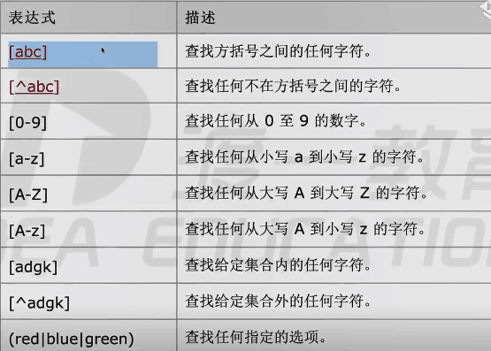

2. 元字符

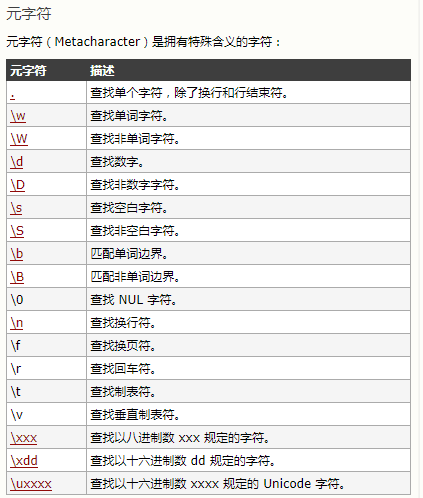

3. 量词

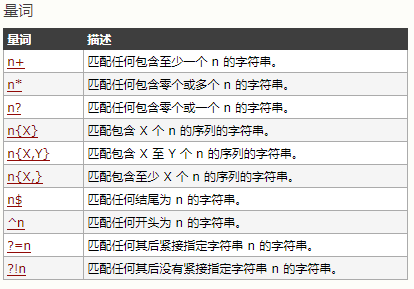

1. RegExp方法 
    exec()          返回匹配结果数组，没有null

    test()          返回true 或者 false

    compile()       改变正则表达式

2. 支持正则的String方法
    search()        检索子字符串

    match()         返回匹配的片段

    replace()       用于替换

    split()         以什么分割

1.js判断输入字符串是否为数字、字母、下划线 

    var reg=/^\w+$/
    str = "1234abd__"
    reg.test(str); 

# 字符串
    字符串方法

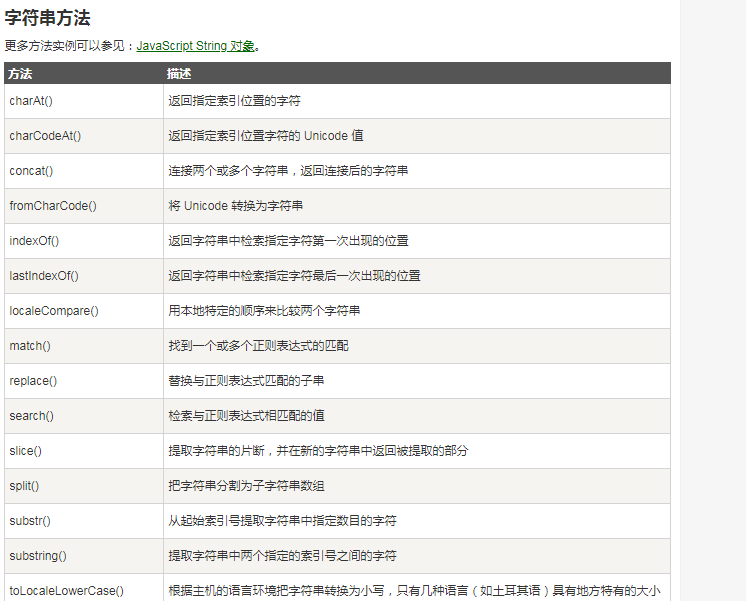

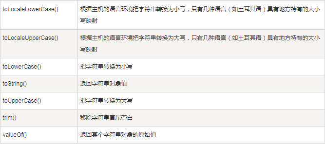

# Math 对象

     Math.round(2.6)           //四舍五入
     Math.ceil(2.4)            //向上取整
     Math.floor(2.8)           //向下取整
     Math.sqrt(64)             //平方
     Math.abs(-3)              //取绝对值
     Math.min(2,33,55)         //最小值
     Math.max(2,33,7)          //最大值
     
     
# 对象

###  创建对象
1.  var obj ={}
2.  构造函数      大驼峰命名规则

    1)系统自带的构造函数    new Object()

    2)自定义

      function  Car(){
          
          this.name ="BMW"         //属性
          this.height ="1440" 
          
          this.run=function(){
              this.health --
          }
          
      }      //构造函数

      var car =new Car();
3.  
 
# 预编译
### 函数体中   发生在函数执行的前一刻
1.创建AO对象   活跃对象  执行期上下文 

2.形参和变量声明的名儿    作为AO的属性名 ，值为undefined

3.将实参和形参统一

4.在函数体找函数声明，值赋予函数体

   例1：

    function fn(a){
        console.log(a)
        var a=123
        console.log(a)
        function a(){}
        console.log(a)
        var b= function (){}
        console.log(b)
        function d(){}
    }
   fn(1)

   例2：

    function test(a,b){
       console.log(a)
       console.log(b)
       var b= 234;
       console.log(b)
       a=123;
       console.log(a)
       function a(){}
       var a;
       b=234;
       var b=function(){}
       console.log(a)
       console.log(b)
   }
   test(1)

### 全局编译环节：
1. 生成一个GO 对象
2. 变量名儿属性
3. 在函数体找函数声明，值赋予函数体
    例：

      console.log(a)
      var a=123;
      function a(){}
      console.log(a)
### 暗示全局变量：

    function test(){      //b暗示全局变量，没经声明就赋值了，属于GO
        var a=b=123;
    }
    test();//AO a  没有b
    console.log(b);
    
#### 先生成GO，后AO

    console.log(test);
    function test(test){
        console.log(test);//输出AO的
        var test=234;
        console.log(test);
        function test(){}
        
    }
    test(1);
    var test =123;

# 作用域
### [[scope]]
     隐式的属性，每个js函数都有一个对象，对象中有些属性我们可以访问，但有些不可以，这些仅供js引擎存取
     [[scope]]:指的就是作用域，其中存储了运行期上下文的集合
### 运行期上下文
     当函数执行时，会创建一个称为执行期上下文的内部对象。一个执行期上下文定义了一个函数执行时的环境，函数每次执行时对应的执行上下文都是独一无二的，所以多次调用一个函数会导致创建多个执行上下文，当函数执行完毕，它所产生的执行上下文被销毁
     
     查找变量：从作用域链的顶端依次向下查找

     例1：

       function a(){                //a,b同一个AO,GO
           function b(){
               
               var bb=234;
               aa=0
           }
           var aa=123
           b();
           console.log(aa)
       }
     var glob=100;
     a();

      例：

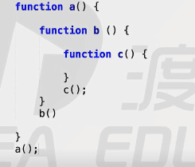

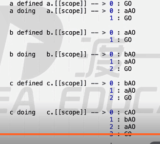

      例：

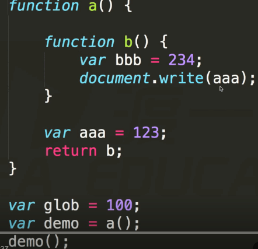

# 作用域链
    [[scope]]中所存储的执行期上下文对象的集合，这个集合呈链式链接，这种链式链接叫作用域链。
# 闭包
####    当内部函数被保存到外部时，将会生成闭包。闭包会导致原有作用域链不释放，造成内存泄露
####    闭包作用
1.实现公有变量（累加器)

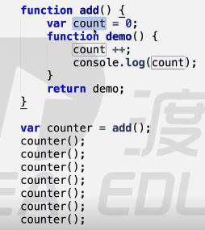

2.可以做缓存（存储结构）

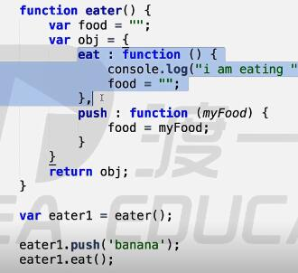

3.实现封装，属性私有化

   

4.模块化开发，防止污染全局变量

    例：

    function a(){
        var num=100;
        function b(){
            num ++;
            console.log(num)
        }
        return b;
    }
    var demo=a();
    demo();
    demo();

   例：

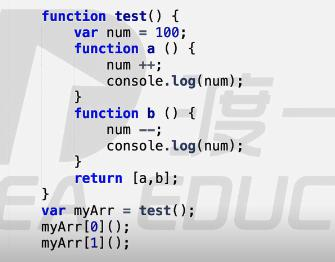
# 立即执行函数
   针对初始化功能的函数

   立即销毁函数，只执行一次

   只有表达式才能被执行符号执行

    例：
    var num = (function(a,b,c){
      //  console.log(a+b+c);
      var d=a+b+c;
      return d;    //有返回值
    }(1,2,3))
# Dom  (Document Object Model)
####    Dom  是一套编程接口，它是让js能操作html和xml的一系列接口，但也可以间接操作css

节点类型：12个

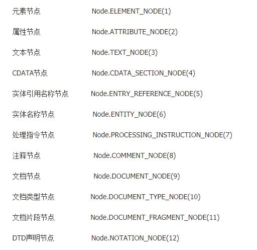

    常用记住的：元素节点、文本节点、注释节点、文档节点（document本身
    ）

    节点的四个属性：
       nodeName  元素标签，以大写形式，表示只读
       nodeValue  Text（文本）节点或comment（注释）        节点的文本内容，可读写
       nodeType   节点类型  只读  （重点记住，判断节点          是什么类型）
       attributes   Element元素节点的属性集合
    节点的一个方法：node.hasChildNodes();
    可在某节点用于任何子节点时返回true，或false
     有子节点就返回true否则false

1.节点树

    基于树形，基于一个相邻的、父元素、子元素、基于关系形
    parentNode 父节点

    <ul><li>Coffee</li><li>Tea</li></ul>
    

    <button onclick="my()">点我</button>

    function my(){
	var x=document.getElementById("demo");  
	var y=document.getElementsByTagName("LI")[0];
	x.innerHTML=y.parentNode.nodeName;
    }

    firstchild   第一个子节点
    Last.....   最后一个字节点
    nextSibling  后一个兄弟元素节点

2.元素节点树：基于元素节点
    parentElement  父元素节点
    firstElementchild  第一个子元素节点
    children 当前元素的所有元素节点

    兼容性不好、除children IE都用不了（IE9以下及IE9），
    W3C IE9，IE9以下 只遵循一部分标准
    IE10 遵循了W3C的标准
####  添加节点，删除、移除、替换、插入节点
      添加 删除 替换 插入到某个接点的方法

1.创建新节点

    createElement()   //创建一个具体的元素
    createTextNode()   //创建一个文本节点

2.添加、移除、替换、插入

    appendChild()      //添加
    removeChild()      //移除
    replaceChild()      //替换
    insertBefore()      //插入

3.查找

    getElementsByTagName()    //通过标签名称
    getElementsByName()     //通过元素的Name属性的值
    getElementById()        //通过元素Id，唯一性

#### Element 节点上的方法

1. setAttribute()  //绑定值
2. getAttribute()  //取出值

     
#### Dom事件
    onclick          点击
    onload           进入页面加载
    onchange         用户改变输入字段的内容
    onmouseover      移入
    onmouseout       移开
    onfocus          获得焦点
#### addEventListener
     addEventListener() 方法用于向指定元素添加事件句柄。
     可以向一个元素添加多个事件句柄
     可以使用 removeEventListener() 方法来移除事件的监听
# 日期对象
1.    是系统提供好的
    var date=new Date;

2.    getDate          一个月某一天
3.    getDay           一周的某一天 周日0
4.    getMonth         月份   从0开始
5.    getFullYear      返回四位数年份
6.    getHours          小时
7.    getMinutes        分钟
8.    getSeconds        秒
9.    getTime           从1970年7月1日到现在的秒数
10.   ...... 

2.   set方法  设置Date对象

       .......

3.   全局window上的方法，内部函数
1.     setInterval    每隔一段时间执行    返回数字 唯一标识
     setInterval（finction（）{
         console.log（）；
     }，（1000））
2.    clearInterval（） 清除定时器，通过唯一标识
3.   setTimeout    推迟一段时间执行  ，只执行一次 
4.   clearTimeout   清除

      例：

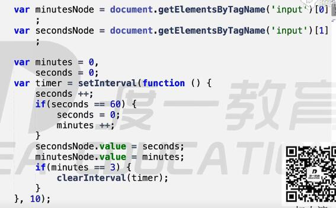

#  call/apply   区别：传参列表不同    作用：改变this指向。

     (借用别人函数，实现自己功能，自己需求必须全部涵盖别人的需求)

     call：根本就是改变this指向；需要实参按形参     的个数传进去

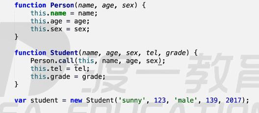

     apply：只能传一个实参，必须是数组

     
     